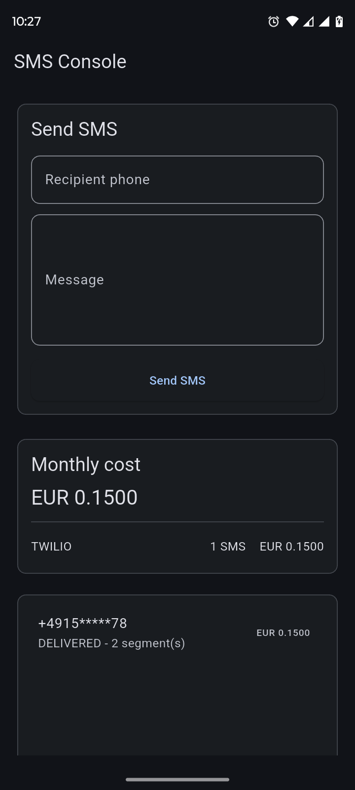
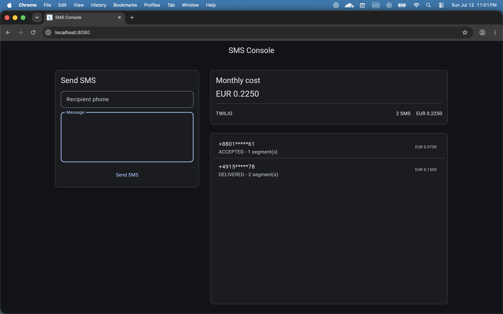
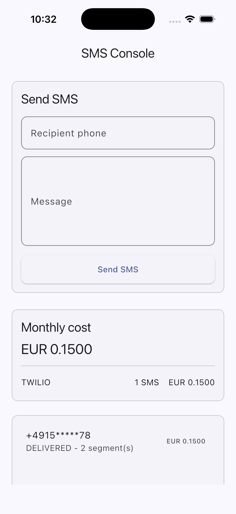

# SMS Console Assignment

A Flutter rebuild of the SMS console using a small, readable Bloc architecture.

## Run

```sh
flutter pub get
flutter run
```

The app uses mock data by default so it can be reviewed without the real backend.

## Screenshots

| Platform | Screenshot |
| --- | --- |
| Android phone, 360 px logical width |  |
| Web desktop, 1400 px layout |  |
| iOS Simulator phone |  |

## Configuration

Copy `.env.example` to `.env` and update local runtime configuration:

```env
BASE_URL=https://api.example.com
USE_MOCK_API=true
DEMO_ACCESS_TOKEN=replace-with-runtime-token
DEMO_TENANT_ID=00000000-0000-0000-0000-000000000000
```

`.env` is loaded with `flutter_dotenv` and is ignored by Git. Keep real tokens
out of committed source; for production, access tokens should come from
authentication and secure storage instead of a bundled env asset.

## What Changed

- Replaced widget-owned HTTP and mutable global state with `SmsBloc`.
- Added a repository with mock and API-backed paths.
- Centralized API headers, endpoints, result handling, and error mapping.
- Added typed SMS models instead of `dynamic` at call sites.
- Added fixed-scale `Money` arithmetic so decimal strings are never parsed as
  `double`.
- Added compact phone and desktop split layouts, light/dark theme, reusable
  form, cost, empty, error, and loading components.

## Tests

```sh
flutter analyze
flutter test
```

Included tests cover decimal money arithmetic, Bloc loading with masked
recipients, a widget validation failure path, and recorded golden coverage for
compact phone and 1400 px desktop layouts.

## Cross-platform Notes

- Run proof: verified on iOS Simulator and Chrome Web desktop.
- Additional mobile proof: verified on Android emulator at 360 px logical width.
- Input uses Flutter text fields with standard keyboard behavior; phone and
  message validation are handled before submit.
- Fonts rely on the platform/default Material font stack, with Roboto loaded in
  golden tests to keep snapshots stable.
- Scrolling is explicit for the send form and message history so compact screens
  and desktop windows do not clip core actions.
- Window resize switches between compact and desktop split layouts at the shared
  responsive breakpoint.
- Text selection is left to the platform defaults; no custom selection toolbar or
  copy workflow was added.

## Deliberately Not Done

- Real token refresh flow. The contract documents it, but this assignment does
  not include an auth backend.
- Bulk SMS was not implemented because the required shipped surface is send SMS,
  paginated history, and cost breakdown.

## Next Week

I would add secure storage, token refresh, and real integration tests against a
mock HTTP server.
